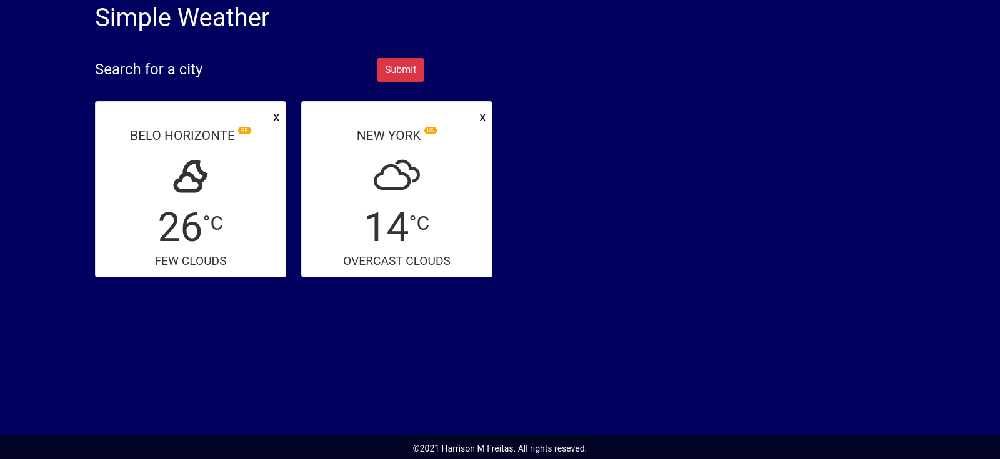
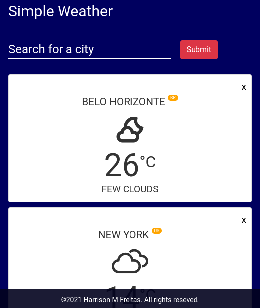

# Weather App

Weather App é uma web page, que informa dados meteorológico, como temperatura e condições climáticas, das cidades informadas

    
    

## Funcionalidades

- Informa as condições climáticas das cidades pesquisadas

## Tecnologias Utilizadas

- JavaScript
- Api Weather
- CSS
- HTML